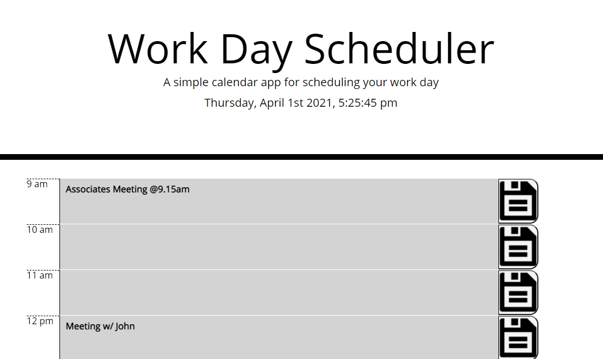

# Code-quizz
Homework due 2021-3-23



## Technologies Used
- HTML - Creates text and differents elements 
- CSS - styles html elements on page
- Javascript - Generate the planner and save the data 
- jQuery - Javascript API to improve the Semantic
- moment.js - Javascript API for the time 
- Local Storage - Store the data
- GitHub - hosts and deploys the pages
- Bash - Terminal

## Summary 
Work day Scheduler,
On this website, you can schedule your workday with accuracy. The boxes are color-coded for a better readability.
You can close the tab and come back later, all the data will still be present.

## Snippet 
```js
var TimeRange = [9, 17];
        if (i < moment().format('H')) {
            textarea.addClass('past');
        } else if (i == moment().format('H')) {
            textarea.addClass('present');
        } else {
            textarea.addClass('future');
        }
```
I used the time in the 24hrs format to easily determine which color to attribute to each box.

## Deployed Link
[Site](https://dylancouzon.github.io/day-planner/)

## Author Links
[LinkedIn](https://www.linkedin.com/in/dcouzon/)
[GitHub](https://github.com/Dylancouzon)
